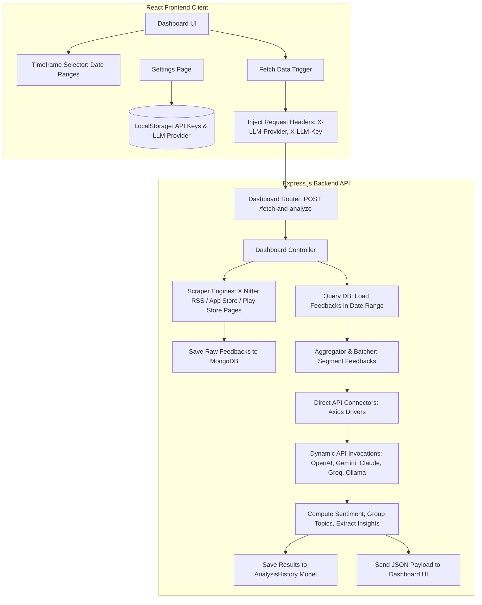

# Prysm - AI-Driven Customer Feedback Analyzer

## Overview

Prysm is an AI-driven system designed to automatically collect, analyze, and interpret customer feedback from multiple digital sources such as emails, support tickets, app reviews, and social media platforms. The system transforms unstructured feedback data into meaningful insights that help businesses understand customer sentiment, detect emerging issues, and make informed product or service improvements.

Conventional feedback analysis often involves manual reading and categorization of customer responses, which is time-consuming and prone to bias. Prysm addresses this challenge by leveraging Artificial Intelligence (AI) and Natural Language Processing (NLP) to automate feedback processing, clustering, and sentiment evaluation. The platform provides real-time analytics, enabling organizations to respond quickly to customer concerns and maintain a positive brand reputation.

## Features

- AI-driven sentiment analysis & trend detection
- "Emerging issues" alerts before they blow up
- Department-specific reports (Support, Product, Marketing)
- Slack & email notifications
- Exportable PDF Reports with Strategic Priority Matrix
- Data history clearing capabilities
- SEO optimized with Open Graph metadata for social sharing
- Unique Angle: Goes beyond sentiment → actually tells teams what to fix
- Target Users: Product managers, Large organisations, customer success teams

## System Overview

Prysm functions as a web-based analytical dashboard that integrates modern AI and data visualization technologies. It consolidates feedback from multiple communication channels, stores inputs persistently in MongoDB, processes them using LLMs, and presents summaries via an interactive dashboard.

### Technical Ingestion & In-Memory Analysis Architecture



The system follows a structured workflow:

1. **Data Ingestion**: Collects customer feedback from five distinct channels (X, App Store, Play Store, Gmail, and CSV files).
2. **Persistence**: Saves raw comments persistently to MongoDB to prevent API timeouts and support historical timeframe searches.
3. **Bring Your Own Key (BYOK) Processing**: Uses client-supplied provider keys (passed in headers) to dynamically initialize LangChain.js AI models (Gemini, Claude, GPT, or local engines) on the backend.
4. **Sentiment & Clustering Analysis**: Processes feedbacks in batches to classify sentiment, detect spikes, and group similar concerns.
5. **Dashboard Visualization**: Renders comparison trend charts and lists based on dynamic database computations.
6. **Collapsible Session History**: Stores completed summary sessions in `AnalysisHistory` for later retrieval on the History tab.


## Getting Started

### Running with Docker (Recommended)

You can run both the frontend and backend of Prysm in a single unified Docker environment.

#### Prerequisites
* [Docker](https://docs.docker.com/get-docker/) installed on your machine.
* [Docker Compose](https://docs.docker.com/compose/install/) installed.

#### Steps to Run
1. Clone the repository and navigate to the project root directory.
2. Build and run the services using Docker Compose:
   ```bash
   docker compose up --build
   ```
3. Once the containers are running:
   * Access the **Prysm Frontend** at `http://localhost:8080` in your web browser.
   * The **Backend API** will run at `http://localhost:5000` (requests are automatically proxied via Nginx from the frontend container).
4. To stop the application:
   ```bash
   docker compose down
   ```

### Deploying with Vercel
The frontend is configured for deployment on Vercel as a Single Page Application (SPA). The repository includes `vercel.json` files with rewrite rules to support client-side routing and the dedicated 404 error page.

### Manual Installation & Local Dev Setup

### User Registration

1. Launch the Prysm web application.
2. Click on "Register" to create a new account.
3. Enter required details such as name, email, password, and department.
4. Verify the email address through the verification link sent to your inbox.
5. Once confirmed, log in using your credentials.

### Login Procedure

1. Navigate to the Login page.
2. Enter your registered email ID and password.
3. Upon successful authentication, `/` becomes the main dashboard. Logged-out users at `/` see the Landing Page with interactive demos and feature highlights, and logged-in users at `/` go straight to the dashboard.

### Navigation Overview

After logging in, users can access all major features through the left-hand navigation panel. The navigation menu includes the following options:

- **Connect Apps**: Integrates Prysm with third-party platforms such as Gmail, Slack, Twitter (X), Facebook, Google Play, and the App Store. Play Store integration includes store state management.

- **Dashboard**: Displays real-time analytics, sentiment summaries, trending topics, and AI-generated insights. Features a premium glassmorphic UI.
- **Custom Data**: Allows users to upload manual feedback files in CSV or Excel format.
- **History**: Provides a chronological record of processed feedback sessions and alerts.
- **Settings**: Allows users to configure application preferences and manage API keys for LLM integrations.
- **Account**: Enables users to manage their personal profile and account settings.
- **Help & Support**: Offers access to FAQs, troubleshooting guides, and support contact details.
- **Documentation**: Contains system architecture, AI workflow, API integrations, and feature explanations.

## Functional Modules

### 5.1 Feedback Ingestion

Users can connect multiple feedback sources through the Connect Apps module. Supported platforms include Gmail, Slack, Twitter, Facebook, and app store APIs.

### 5.2 Data Preprocessing

Cleans and standardizes feedback text by removing unwanted symbols, links, emojis, and redundant spaces. Duplicate entries are filtered to ensure unique records. Non-English text is automatically translated into English.

### 5.3 Sentiment Analysis

Classifies feedback into Positive, Negative, and Neutral categories. Sentiment scores are displayed through charts to visualize customer mood distributions.

### 5.4 Topic Clustering

Feedback is converted into semantic embeddings using AI models. K-means or DBSCAN algorithms group similar comments into topics such as payment issues or feature requests.

### 5.5 Insight Generation

GPT-based summarization produces concise reports that highlight major issues or requests.

**Example**: "This week, 35% of feedback mentioned login difficulties following the latest app update."

### 5.6 Trend Detection

Compares topic frequencies and sentiment changes week-over-week to identify emerging issues or improvements.

### 5.7 Real-Time Alerts

If a spike in negative feedback occurs, Prysm sends alerts through Slack or email.

**Example**: "Negative feedback on payment processing increased by 150% in the last 24 hours."

### 5.8 Reporting

Generates automated reports filtered by sentiment, time period, or source. Exportable in PDF or Excel format.

## Dashboard Overview

The dashboard is the main analytical hub of Prysm, providing real-time visualization of AI-processed feedback data.

Key components include:

- **Sentiment Overview**: Displays positive, negative, and neutral feedback proportions.
- **Trending Topics**: Lists the most frequently discussed themes detected by AI.
- **Source Distribution**: Shows the share of feedback from each integrated source.
- **Trend Graphs**: Illustrate weekly or monthly changes in sentiment.
- **Insight Panel**: Provides AI-generated summaries.
- **Live Feed Section**: Updates continuously when new data arrives.

## Notifications and Alerts

Ensures all critical feedback trends are communicated promptly.

- **In-App Notification Modal**: A built-in UI component alerting users of trends and updates directly within the application.
- **Slack Alerts**: Integrated via Slack API to deliver messages directly to channels.
- **Email Alerts**: Sent automatically through Gmail or Microsoft Graph APIs.
- **Custom Thresholds**: Admins can set trigger limits, e.g., alert when negative feedback exceeds 100 mentions per day.

These notifications improve response speed and customer satisfaction.

## User Roles and Permissions

Prysm uses Role-Based Access Control (RBAC) with defined permissions:

- **Administrator** — Manages users, integrations, and settings. (Full Access)
- **Product Manager** — Views dashboards, reports, and insights. (Moderate Access)
- **Support Team Member** — Reviews customer issues and complaint clusters. (Limited Access)


## Creators

<table>
  <tbody>
    <tr>
    <td align="center" valign="top" width="14.28%"><a href="https://github.com/manasdutta04"><br /><sub><b>Manas Dutta</b></sub></a><br /></td>
    <td align="center" valign="top" width="14.28%"><a href="https://github.com/paritoshdey-dev"><br /><sub><b>Paritosh Dey</b></sub></a><br /></td>
    <td align="center" valign="top" width="14.28%"><a href="https://github.com/kabyasarkar01-tech"><br /><sub><b>Kabya Sarkar</b></sub></a><br /></td>
    <td align="center" valign="top" width="14.28%"><a href="https://github.com/SnehaGhosh4700"><br /><sub><b>Sneha Ghosh</b></sub></a><br /></td>
    <td align="center" valign="top" width="14.28%"><a href="https://github.com/Jayantjha17"><br /><sub><b>Jayant Kumar Jha</b></sub></a><br /></td>
    </tr>
  </tbody>
</table>
