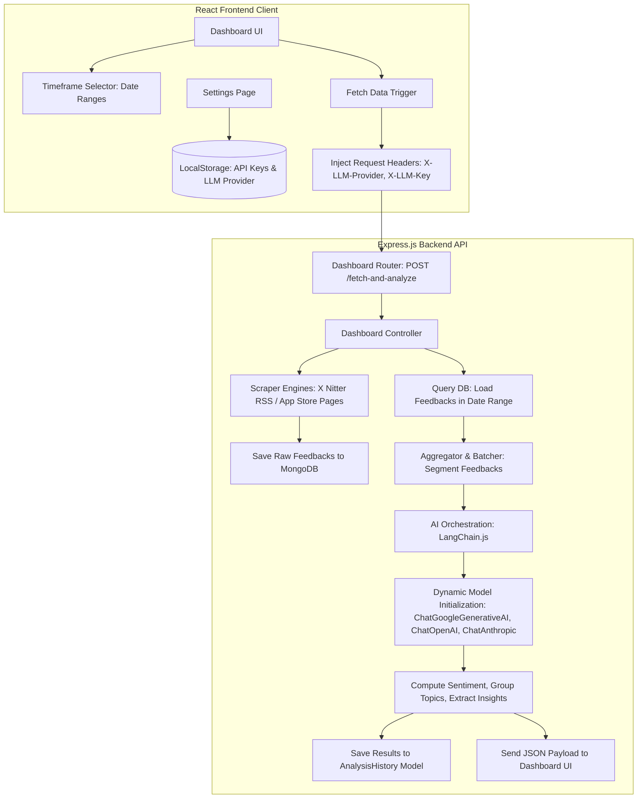

# Prysm: Developer Agent Guidelines & Directory

This repository is configured for collaborative development by multiple developers and AI agents. To maintain consistency, keep code modular, and avoid breaking teammate implementations, follow the specific guides in the **[.agent/](file:///c:/Coding%20Workspace/prysm/.agent)** directory.

---

## Technical Pipeline Architecture

The diagram below outlines the full data flow and execution pipeline for timeframe-based ingestion and the Bring Your Own API Key (BYOK) AI analysis system:

---

## Developer Agent Documentation Directory

Please review the following documentation files before writing code:

1. **[1. Product Vision & Feature Scope](file:///c:/Coding%20Workspace/prysm/.agent/vision_and_scope.md)**
   * High-level user flow.
   * Core modules (Dashboard, Connect Apps, Custom Data, Analysis History).
   * Ingestion flow and Bring Your Own API Key specifications.
2. **[2. Technology Stack & Database Schemas](file:///c:/Coding%20Workspace/prysm/.agent/tech_stack_and_db.md)**
   * Express, React, and MongoDB architecture.
   * Database Mongoose definitions for `Feedback`, `User`, and `AnalysisHistory`.
   * Integrations for dynamic AI model interfaces.
3. **[3. Limitations, Restrictions, & Team Ownership Rules](file:///c:/Coding%20Workspace/prysm/.agent/limitations_and_restrictions.md)**
   * Critical constraints: Do NOT modify or delete `fetchEmailDetails.js` or `gmailUser.model.js`.
   * Dashboard fetch restrictions (App Store and X only, no active Gmail fetches).
   * App Store pagination and Nitter RSS scraper constraints.
4. **[4. UI/UX Design System & Theme Guidelines](file:///c:/Coding%20Workspace/prysm/.agent/ui_ux_guidelines.md)**
   * Premium dark-theme details, glassmorphism card parameters, and transition guidelines.
   * Color palette tokens and font styling rules.

---

## Execution & Code Quality Standards

* **Clean Linting**: Ensure all frontend changes pass `npm run lint` cleanly.
* **No Hardcoded/Static Outputs**: Ensure all stats, numbers, previous metrics, and charts are calculated dynamically from actual MongoDB database queries. Do not use hardcoded sample values in the production dashboard files.
